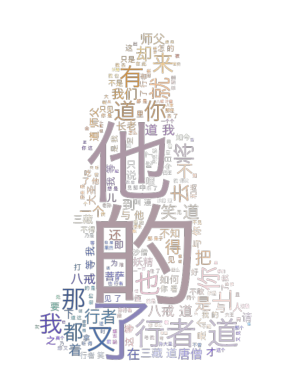
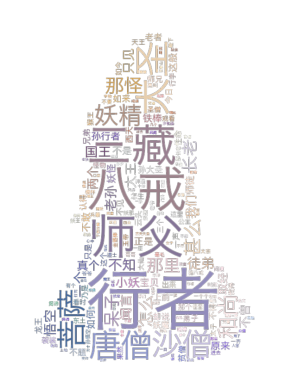

```python
from wordcloud import WordCloud
import matplotlib.pyplot as plt
import jieba
```


```python
# 打开文本
text = open('constitution.txt').read()
# 生成对象
wc = WordCloud().generate(text)

# 显示词云
plt.imshow(wc, interpolation='bilinear')
plt.axis('off')
plt.show()

# 保存到文件
wc.to_file('files/wordcloud1.png')
```


    

    


    <wordcloud.wordcloud.WordCloud at 0x23f79e10350>


```python
# 打开文本
text = open('xyj.txt',encoding='utf-8').read()
# UnicodeDecodeError: 'gbk' codec can't decode byte 0x80 in position 2: illegal multibyte sequence
# 不加 encoding='utf-8' 报错 gbk can't decode oxbe
# 生成对象
wc = WordCloud(font_path='Hiragino.ttf', width=800, height=600, mode='RGBA', background_color=None).generate(text)

# 显示词云
plt.imshow(wc, interpolation='bilinear')
plt.axis('off')
plt.show()

# 保存到文件
wc.to_file('files/wordcloud2.png')
```


    

    


    <wordcloud.wordcloud.WordCloud at 0x23f72d96450>


```python
# 打开文本
text = open('xyj.txt',encoding='utf-8').read()

# 中文分词
text = ' '.join(jieba.cut(text))
print(text[:100])

# 生成对象
wc = WordCloud(font_path='Hiragino.ttf', width=800, height=600, mode='RGBA', background_color=None).generate(text)

# 显示词云
plt.imshow(wc, interpolation='bilinear')
plt.axis('off')
plt.show()

# 保存到文件
wc.to_file('files/wordcloud3.png')
```

    Building prefix dict from the default dictionary ...
    Dumping model to file cache C:\Users\hechang\AppData\Local\Temp\jieba.cache
    Loading model cost 0.429 seconds.
    Prefix dict has been built successfully.
    

    　 　 [ 西游记   /   吴承恩 （ 明 ）   著   ] 
     
     　 　 书籍 介绍 : 
     　 　 《 西游记 》 以 丰富 瑰奇 的 想象 描写 了 师徒 四众 在 迢遥 的 西方 途上
    


    

    


    <wordcloud.wordcloud.WordCloud at 0x23f782a6110>


```python
# 去除停用词
```

## main-4


```python
from PIL import Image
import numpy as np

# 打开文本
text = open('xyj.txt',encoding='utf-8').read()

# 中文分词
text = ' '.join(jieba.cut(text))
print(text[:100])

# 生成对象
mask = np.array(Image.open("black_mask.png"))
wc = WordCloud(mask=mask, font_path='Hiragino.ttf', mode='RGBA', background_color=None).generate(text)

# 显示词云
plt.imshow(wc, interpolation='bilinear')
plt.axis("off")
plt.show()

# 保存到文件
wc.to_file('files/wordcloud4.png')
```

    　 　 [ 西游记   /   吴承恩 （ 明 ）   著   ] 
     
     　 　 书籍 介绍 : 
     　 　 《 西游记 》 以 丰富 瑰奇 的 想象 描写 了 师徒 四众 在 迢遥 的 西方 途上
    


    

    


    <wordcloud.wordcloud.WordCloud at 0x23f72519f50>


## main-5


```python
from wordcloud import WordCloud, ImageColorGenerator
from PIL import Image
import numpy as np


# 打开文本
text = open('xyj.txt',encoding='utf-8').read()

# 中文分词
text = ' '.join(jieba.cut(text))
print(text[:100])

# 生成对象
mask = np.array(Image.open("color_mask.png"))
wc = WordCloud(mask=mask, font_path='Hiragino.ttf', mode='RGBA', background_color=None).generate(text)

# 从图片中生成颜色
image_colors = ImageColorGenerator(mask)
wc.recolor(color_func=image_colors)

# 显示词云
plt.imshow(wc, interpolation='bilinear')
plt.axis("off")
plt.show()

# 保存到文件
wc.to_file('files/wordcloud5.png')
```

    　 　 [ 西游记   /   吴承恩 （ 明 ）   著   ] 
     
     　 　 书籍 介绍 : 
     　 　 《 西游记 》 以 丰富 瑰奇 的 想象 描写 了 师徒 四众 在 迢遥 的 西方 途上
    


    

    


    <wordcloud.wordcloud.WordCloud at 0x23f0377b150>


## main-6


```python
from wordcloud import WordCloud
from PIL import Image
import numpy as np
import matplotlib.pyplot as plt
import random
import jieba

# 打开文本
text = open('xyj.txt',encoding='utf-8').read()

# 中文分词
text = ' '.join(jieba.cut(text))
print(text[:100])

# 颜色函数
def random_color(word, font_size, position, orientation, font_path, random_state):
	s = 'hsl(0, %d%%, %d%%)' % (random.randint(60, 80), random.randint(60, 80))
	print(s)
	return s

# 生成对象
mask = np.array(Image.open("color_mask.png"))
wc = WordCloud(color_func=random_color, mask=mask, font_path='Hiragino.ttf', mode='RGBA', background_color=None).generate(text)

# 显示词云
plt.imshow(wc, interpolation='bilinear')
plt.axis("off")
plt.show()

# 保存到文件
wc.to_file('wordcloud6.png')
```

    　 　 [ 西游记   /   吴承恩 （ 明 ）   著   ] 
     
     　 　 书籍 介绍 : 
     　 　 《 西游记 》 以 丰富 瑰奇 的 想象 描写 了 师徒 四众 在 迢遥 的 西方 途上
    hsl(0, 61%, 63%)
    hsl(0, 80%, 77%)
    hsl(0, 62%, 67%)
    hsl(0, 80%, 67%)
    hsl(0, 79%, 79%)
    hsl(0, 75%, 79%)
    hsl(0, 69%, 65%)
    hsl(0, 62%, 75%)
    hsl(0, 71%, 60%)
    hsl(0, 80%, 74%)
    hsl(0, 78%, 62%)
    hsl(0, 70%, 67%)
    hsl(0, 79%, 78%)
    hsl(0, 63%, 62%)
    hsl(0, 76%, 63%)
    hsl(0, 67%, 64%)
    hsl(0, 60%, 77%)
    hsl(0, 60%, 71%)
    hsl(0, 80%, 62%)
    hsl(0, 77%, 73%)
    hsl(0, 66%, 67%)
    hsl(0, 74%, 80%)
    hsl(0, 66%, 78%)
    hsl(0, 62%, 61%)
    hsl(0, 80%, 72%)
    hsl(0, 73%, 77%)
    hsl(0, 66%, 74%)
    hsl(0, 73%, 60%)
    hsl(0, 72%, 63%)
    hsl(0, 74%, 71%)
    hsl(0, 66%, 79%)
    hsl(0, 61%, 67%)
    hsl(0, 63%, 77%)
    hsl(0, 71%, 72%)
    hsl(0, 63%, 60%)
    hsl(0, 62%, 66%)
    hsl(0, 79%, 69%)
    hsl(0, 68%, 60%)
    hsl(0, 80%, 77%)
    hsl(0, 74%, 76%)
    hsl(0, 76%, 64%)
    hsl(0, 74%, 65%)
    hsl(0, 73%, 69%)
    hsl(0, 78%, 66%)
    hsl(0, 70%, 80%)
    hsl(0, 62%, 69%)
    hsl(0, 77%, 75%)
    hsl(0, 71%, 60%)
    hsl(0, 80%, 78%)
    hsl(0, 72%, 74%)
    hsl(0, 80%, 72%)
    hsl(0, 72%, 74%)
    hsl(0, 60%, 73%)
    hsl(0, 67%, 71%)
    hsl(0, 67%, 61%)
    hsl(0, 67%, 71%)
    hsl(0, 75%, 66%)
    hsl(0, 71%, 61%)
    hsl(0, 66%, 76%)
    hsl(0, 75%, 80%)
    hsl(0, 80%, 73%)
    hsl(0, 70%, 61%)
    hsl(0, 80%, 75%)
    hsl(0, 65%, 79%)
    hsl(0, 74%, 76%)
    hsl(0, 72%, 76%)
    hsl(0, 80%, 66%)
    hsl(0, 64%, 65%)
    hsl(0, 80%, 75%)
    hsl(0, 72%, 60%)
    hsl(0, 75%, 70%)
    hsl(0, 64%, 67%)
    hsl(0, 75%, 65%)
    hsl(0, 63%, 78%)
    hsl(0, 62%, 77%)
    hsl(0, 80%, 67%)
    hsl(0, 70%, 71%)
    hsl(0, 71%, 61%)
    hsl(0, 70%, 70%)
    hsl(0, 62%, 77%)
    hsl(0, 61%, 60%)
    hsl(0, 78%, 77%)
    hsl(0, 79%, 73%)
    hsl(0, 63%, 76%)
    hsl(0, 79%, 75%)
    hsl(0, 80%, 68%)
    hsl(0, 70%, 73%)
    hsl(0, 76%, 68%)
    hsl(0, 64%, 65%)
    hsl(0, 76%, 64%)
    hsl(0, 62%, 60%)
    hsl(0, 64%, 65%)
    hsl(0, 79%, 76%)
    hsl(0, 77%, 75%)
    hsl(0, 73%, 68%)
    hsl(0, 65%, 72%)
    hsl(0, 74%, 63%)
    hsl(0, 65%, 61%)
    hsl(0, 65%, 80%)
    hsl(0, 70%, 63%)
    hsl(0, 62%, 65%)
    hsl(0, 69%, 62%)
    hsl(0, 73%, 64%)
    hsl(0, 67%, 77%)
    hsl(0, 64%, 70%)
    hsl(0, 74%, 74%)
    hsl(0, 71%, 61%)
    hsl(0, 69%, 79%)
    hsl(0, 65%, 64%)
    hsl(0, 79%, 63%)
    hsl(0, 71%, 71%)
    hsl(0, 60%, 63%)
    hsl(0, 66%, 73%)
    hsl(0, 67%, 70%)
    hsl(0, 74%, 74%)
    hsl(0, 75%, 60%)
    hsl(0, 65%, 64%)
    hsl(0, 68%, 80%)
    hsl(0, 75%, 80%)
    hsl(0, 67%, 79%)
    hsl(0, 75%, 68%)
    hsl(0, 73%, 62%)
    hsl(0, 61%, 75%)
    hsl(0, 70%, 67%)
    hsl(0, 75%, 75%)
    hsl(0, 78%, 79%)
    hsl(0, 68%, 78%)
    hsl(0, 67%, 61%)
    hsl(0, 64%, 73%)
    hsl(0, 72%, 64%)
    hsl(0, 69%, 73%)
    hsl(0, 67%, 79%)
    hsl(0, 64%, 63%)
    hsl(0, 71%, 72%)
    hsl(0, 71%, 67%)
    hsl(0, 77%, 74%)
    hsl(0, 67%, 68%)
    hsl(0, 60%, 71%)
    hsl(0, 79%, 76%)
    hsl(0, 65%, 71%)
    hsl(0, 70%, 60%)
    hsl(0, 63%, 77%)
    hsl(0, 78%, 77%)
    hsl(0, 65%, 68%)
    hsl(0, 72%, 78%)
    hsl(0, 70%, 68%)
    hsl(0, 60%, 75%)
    hsl(0, 63%, 78%)
    hsl(0, 64%, 67%)
    hsl(0, 73%, 76%)
    hsl(0, 60%, 73%)
    hsl(0, 72%, 66%)
    hsl(0, 68%, 78%)
    hsl(0, 80%, 72%)
    hsl(0, 79%, 60%)
    hsl(0, 61%, 72%)
    hsl(0, 64%, 71%)
    hsl(0, 60%, 63%)
    hsl(0, 62%, 78%)
    hsl(0, 74%, 78%)
    hsl(0, 75%, 65%)
    hsl(0, 62%, 75%)
    hsl(0, 60%, 65%)
    hsl(0, 73%, 80%)
    hsl(0, 61%, 78%)
    hsl(0, 73%, 63%)
    hsl(0, 80%, 70%)
    hsl(0, 75%, 61%)
    hsl(0, 64%, 75%)
    hsl(0, 69%, 63%)
    hsl(0, 66%, 79%)
    hsl(0, 64%, 63%)
    hsl(0, 60%, 65%)
    hsl(0, 66%, 67%)
    hsl(0, 66%, 77%)
    hsl(0, 78%, 68%)
    hsl(0, 60%, 65%)
    hsl(0, 67%, 64%)
    hsl(0, 68%, 60%)
    hsl(0, 78%, 79%)
    hsl(0, 79%, 64%)
    hsl(0, 76%, 63%)
    hsl(0, 80%, 70%)
    hsl(0, 74%, 71%)
    hsl(0, 69%, 69%)
    hsl(0, 79%, 68%)
    hsl(0, 76%, 68%)
    hsl(0, 73%, 69%)
    hsl(0, 80%, 70%)
    hsl(0, 78%, 69%)
    hsl(0, 78%, 80%)
    hsl(0, 67%, 62%)
    hsl(0, 68%, 75%)
    hsl(0, 69%, 67%)
    hsl(0, 66%, 69%)
    hsl(0, 76%, 75%)
    hsl(0, 60%, 73%)
    hsl(0, 64%, 66%)
    hsl(0, 64%, 71%)
    hsl(0, 63%, 74%)
    hsl(0, 67%, 61%)
    hsl(0, 63%, 71%)
    


    

    


    <wordcloud.wordcloud.WordCloud at 0x23f782448d0>


## main-7


```python
# -*- coding: utf-8 -*-

from wordcloud import WordCloud, ImageColorGenerator
from PIL import Image
import numpy as np
import matplotlib.pyplot as plt
import jieba.analyse

# 打开文本
text = open('xyj.txt',encoding='utf-8').read()

# 提取关键词和权重
freq = jieba.analyse.extract_tags(text, topK=200, withWeight=True)
print(freq[:20])
freq = {i[0]: i[1] for i in freq}

# 生成对象
mask = np.array(Image.open("color_mask.png"))
wc = WordCloud(mask=mask, font_path='Hiragino.ttf', mode='RGBA', background_color=None).generate_from_frequencies(freq)

# 从图片中生成颜色
image_colors = ImageColorGenerator(mask)
wc.recolor(color_func=image_colors)

# 显示词云
plt.imshow(wc, interpolation='bilinear')
plt.axis("off")
plt.show()

# 保存到文件
wc.to_file('wordcloud7.png')
```

    [('行者', 0.13267208087376123), ('八戒', 0.060545784492521626), ('师父', 0.05548787651373802), ('三藏', 0.04881099376082701), ('大圣', 0.03393280864329511), ('唐僧', 0.03049170994138356), ('沙僧', 0.028239337327820406), ('菩萨', 0.027923172773813284), ('妖精', 0.025040478734388093), ('和尚', 0.02224147041243598), ('那怪', 0.020501777748003852), ('甚么', 0.02041031848558598), ('那里', 0.019449387366471244), ('长老', 0.018936486818456447), ('呆子', 0.017720452196271354), ('怎么', 0.016808465831007834), ('徒弟', 0.016589847268665824), ('不知', 0.01656892529856913), ('老孙', 0.015984555806169972), ('悟空', 0.015943237776945278)]
    


    

    


    <wordcloud.wordcloud.WordCloud at 0x23f0046e5d0>


